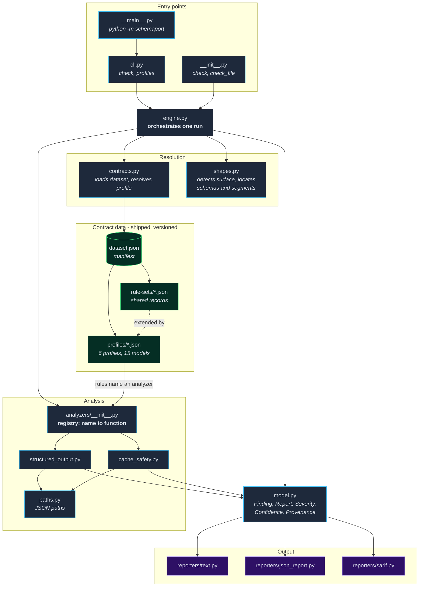

# Architecture

This document explains the design decisions behind Schemaport: where it sits
relative to the provider call, why static preflight analysis earns its place in
both CI and agent loops, why the checker and the contract data are separate
things, and why every v0.1 analysis is deterministic, offline, and free of side
effects.

## The shape of a run

A run has four stages and no branches that reach outside the process:

```text
rendered request JSON  +  target model
        |
        v
profile resolution      pick the contract profile for that model from the
        |               bundled, versioned dataset
        v
analysis                structured-output conformance and cache-safety
        |               heuristics, over the request as written
        v
findings                rule ID, JSON path, severity, remediation,
        |               confidence, provenance, dataset version
        v
report                  text, JSON, or SARIF; exit status from --fail-on
```

The input is a request body you have already rendered — the JSON you were about
to hand to a provider. Everything Schemaport knows about the target comes from
the bundled dataset. Nothing in the pipeline reads the network, and nothing
writes back to the request.

In the source these stages map to `engine.check` (the whole pipeline),
`contracts.ContractDataset.resolve` (profile resolution), `shapes.build_view`
(locating schemas, tool definitions, and content segments in one provider's
request layout), the analyzers under `analyzers/`, and the renderers under
`reporters/`.

## Module map

The same pipeline, by file. The seam worth noticing is `analyzers/__init__.py`:
analyzers are registered by name, and a rule in the dataset names the analyzer
it wants. That indirection is what keeps provider knowledge out of the code.



Everything inside the package is offline. One tool sits outside it:
`tools/verify_contract_data.py` re-fetches the provider artifacts that records
cite and reports drift. It is networked, opt-in, not installed with the
package, and run on a schedule by `.github/workflows/contract-drift.yml`.

## Outside the execution path, on purpose

Schemaport is not a proxy, middleware layer, SDK wrapper, or transport hook. It
never becomes a dependency of your request path. That is a deliberate choice,
and it buys four things.

**It can run where the provider cannot be reached.** Air-gapped evaluation
harnesses, locked-down CI runners, and sandboxed agent containers frequently
have no egress and no credentials. A checker that needs a network round trip or
an API key does not run there at all. Because Schemaport resolves everything
from a bundled dataset, the same check that runs on a developer laptop runs
unchanged inside a sealed container.

**It can run at whatever moment is useful.** A check that lives in the request
path only ever runs at one point: when a request is dispatched. Schemaport is
just a command over a file, so the same analysis can be applied to a request an
agent is about to send, a fixture committed to a repository, a request captured
from a staging run, or a template rendered during a build. The analysis does not
know or care which of those it is looking at.

**Adopting it changes nothing about how you send requests.** There is no client
to swap, no base URL to redirect, no wrapper to keep in sync with an upstream
SDK. Schemaport reads a file and writes a report. If you stop using it, your
request path is exactly what it was — which also means a Schemaport bug cannot
break a production call.

**It stays honest about what it is measuring.** Schemaport analyzes a request as
written; it does not observe a response. That boundary keeps every finding a
statement about the request document rather than a prediction about a provider's
runtime behavior, and it is why the tool reports risk and non-conformance rather
than claiming acceptance, cache hits, token counts, or costs.

The tradeoff is real and worth naming: because Schemaport is outside the
execution path, something has to call it. It does not automatically see every
request your application sends. In exchange, it runs everywhere, is safe to
adopt, and cannot take production down.

## Why static preflight is worth doing twice

The same analysis serves two consumers with different needs.

### In CI

CI wants a gate: a deterministic pass or fail that can block a merge. Request
contracts are a good fit for one, because contract defects are not caught by the
tests teams usually write. A unit test asserts that your code produced the
schema you intended; it does not assert that the provider you are targeting
supports that schema. The gap between those two statements is exactly what
Schemaport checks.

Committing rendered request fixtures and checking them on every pull request
turns "does this request conform to the profile for the model we route to?" into
a reviewable, versioned property of the repository. `--fail-on` chooses the
severity that blocks; SARIF output lets existing code-scanning UIs display
findings without a bespoke integration.

### In an agent repair loop

An agent needs something CI does not: findings it can act on without a human.
That requires each finding to answer three questions mechanically — what is
wrong (`rule_id`), where (`path`), and what to do about it (`remediation`). When
all three are machine-readable, an agent can locate the offending node in its
own pending request, apply the remediation, and check again before it spends a
single token.

This is the part that benefits most from being static. A repair loop needs to
run the check many times in quick succession, on requests that were never sent
and may never be sent. Any check with a network call, a rate limit, a cost, or a
side effect is unusable in that position. A pure function over a file is not.

See [agent-integration.md](agent-integration.md) for the loop in detail.

## The checker and the contract data are separate

The engine and the dataset change for different reasons and at different rates.
Traversal logic, path construction, severity handling, and report rendering are
stable. What a given provider enforces for a given model is not — it varies by
model, shifts across API versions, and sometimes diverges from the published
documentation.

The split is literal, not just conceptual. An analyzer is a function from
`(context, rule)` to findings; it owns traversal and nothing else. The rule —
a record in `src/schemaport/data/profiles/` — owns the claim: the threshold, the
keyword list, the message, the remediation, the severity, the confidence, and
the provenance. `structured_output.max_depth` does not know what a reasonable
depth is; the profile tells it. `cache.volatile_prefix` does not know what a
volatile value looks like; the patterns come from the record.

Keeping them apart has consequences that matter more than the tidiness:

- **Findings can be attributed.** Every rule carries the dataset version, the
  provider and model profile it applies to, a confidence level, and a provenance
  record. A finding is traceable to the claim that produced it, and that claim is
  reviewable on its own terms.
- **Contract claims can be reviewed as data.** Adding or correcting a rule is a
  change to a dataset record, not a patch to traversal code. Someone who knows a
  provider's behavior can review the claim without reading the checker.
- **Scope is enforceable.** Because a rule is a record rather than a branch in
  code, it can be required to name its provider, model, and version scope. The
  loader rejects a record that cannot, and the test suite asserts that no rule
  claims a model outside the profile it lives in.
  [contract-data.md](contract-data.md) covers the rules this imposes.
- **The engine stays small.** The checker's job is to traverse a request, match
  it against profile records, and emit findings. Keeping provider knowledge out
  of it is what keeps it simple enough to trust.

There is a third piece between the two: a request-shape adapter, which knows
that a JSON Schema lives under `response_format.json_schema.schema` on one
surface and `tools[i].input_schema` on another. Adding a provider surface is one
adapter plus dataset records — no analyzer changes.

The durable asset here is the dataset. A traversal engine is straightforward
work; a record of provider behavior that stays accurate, scoped, and cited is
the part that takes sustained effort.

## Deterministic, offline, side-effect-free

Every analysis in v0.1 holds all three properties. They are not independent
niceties — each one is load-bearing for a different consumer.

**Deterministic.** The same request, the same model, and the same contract
dataset version produce the same findings, in the same order, every time.
Findings are sorted by severity, then rule ID, then path, so ties do not depend
on which analyzer happened to run first. There is no sampling, no model call,
and no clock-dependent or randomized behavior in the analysis. This is what lets
CI diff two reports and attribute the difference to a real change, and what lets
an agent conclude that a finding disappeared because its repair worked rather
than because the check was noisy.

**Offline.** All provider knowledge is bundled and versioned in the
distribution. No network call, API key, credential, or provider account is
required — importing the package and running a check both work with egress fully
blocked, and the test suite asserts it by disabling sockets and running a check
anyway. This is a hard requirement for the sandboxed and air-gapped environments
Schemaport targets, and it also means a check can never leak the request it is
inspecting.

**Side-effect-free.** A check reads the request file and writes a report to
standard output. It does not modify the input, write hidden state, phone home,
emit telemetry, or send anything to a provider. Repairs are applied by the
caller, never by Schemaport. Running a check is always safe to repeat, and
running it a hundred times in a repair loop costs nothing but CPU.

Together these make the check something an autonomous process can call freely.
That is the property the agent integration depends on, and it is why the v0.1
boundary is drawn where it is: no probes, no proxies, no runtime observation,
no network — just a deterministic function from a request and a profile to a set
of findings.

## What this architecture rules out

Some things are outside the design, not merely unimplemented:

- Observing responses, evaluating output quality, or judging prompt content.
- Proxying, intercepting, or otherwise participating in the request path.
- Reporting actual token counts, cache hits, latency, or spend.
- Guaranteeing that a clean check means the provider will accept the request.

A clean report means the request conforms to the selected profile as far as the
bundled contract data goes. Provider behavior can change, and the dataset can be
incomplete or stale for a given model. The findings state their confidence and
provenance so you can judge how much weight each one carries.
